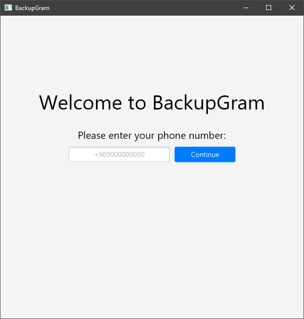
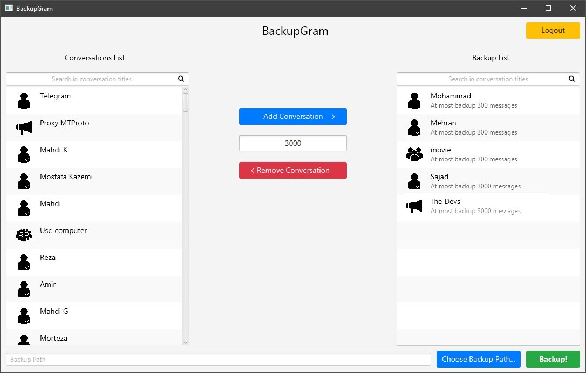
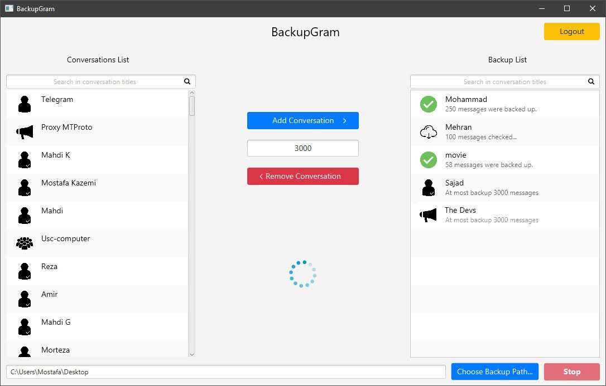
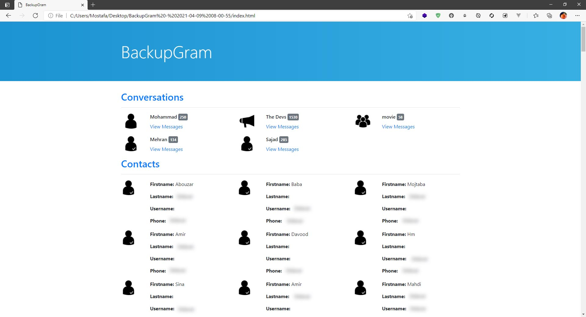
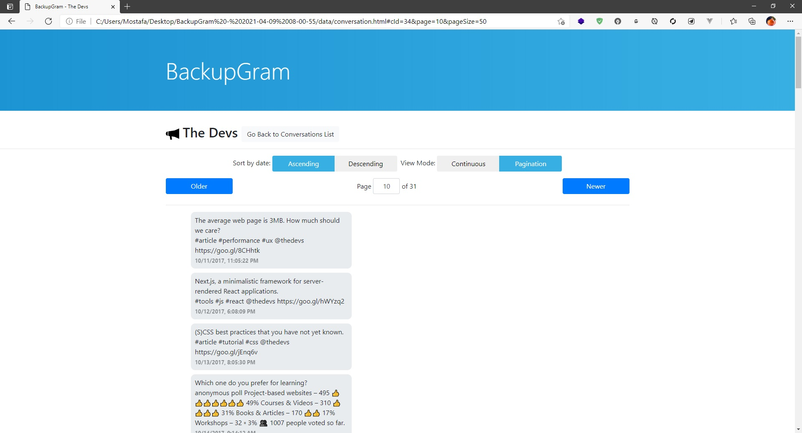

# BackupGram

A Telegram client which its only purpose is to back up your messages in chats, groups and channels
and store them as HTML and Excel files.

This experimental project, suggested by my AI teacher in
sixth semester of university, was created before Telegram added its backup feature.

Internally, BackupGram uses [this project](https://github.com/rubenlagus/TelegramApi)
to call Telegram APIs; because some modifications were needed, the entire source is
included in BackupGram source.

## Running BackupGram

* Obtain your app `api_id` and `api_hash` using [this tutorial](https://core.telegram.org/api/obtaining_api_id);
* Install Java 8 (newer Java versions don't include JavaFX and needed to be included using maven dependency) and Maven;
* Run `mvn clean compile assembly:single` to create JAR file;
* `cd target`;
* Start BackupGram using `java -Dfile.encoding=UTF-8 -jar JAR_FILE.jar --api-id=<YOUR_API_ID> --api-hash=<YOUR_API_HASH>`

## Screenshots

